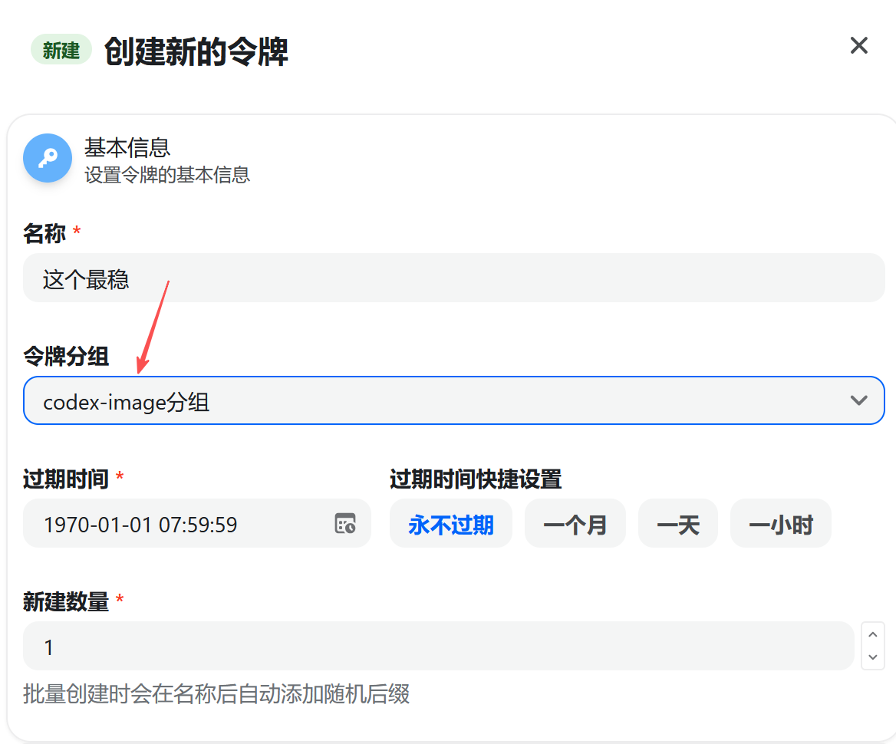
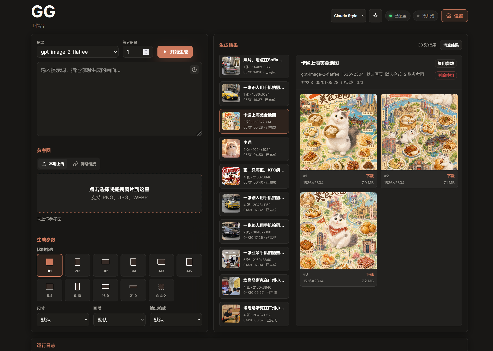

# APIQIK Image Generator

基于 https://img.apiqik.online/ 做的个人优化版。

这是一个用来批量生成图片的网页工具，直接双击启动就能用。

---

## 💻 下载与运行

**第一步：下载代码**
如果你懂 Git，可以在终端执行：
```bash
git clone https://github.com/Seren-dipity/APIQIK-GG-WebUI.git
```
*(或直接点击网页上的绿色按钮 `Code` -> `Download ZIP`，下载后解压出来即可)*

**第二步：安装依赖**
1. 确保电脑上安装了 **Python 3.10** 及以上的版本。
2. 打开解压后的文件夹，在路径栏输入 `cmd` 回车打开小黑框。
3. 复制下面这行命令并回车，等待安装完成：
```bash
pip install -r requirements.txt
```

**第三步：启动工具**
1. 双击项目文件夹里的 **`启动.bat`**。
2. 等黑框跑完，浏览器会自动打开网页 `http://127.0.0.1:8080/` 就可以用了。

*(如果碰到端口被占用，按屏幕上的中文提示操作换个端口就行)*

---

## ⚙️ 怎么配置密钥（非常重要）

第一次用，必须先点网页右上角的“**设置**”填好密钥。

> [!TIP]
> **💡 密钥怎么填最稳定？（经验之谈）**
> - 亲测用 **`codex-image`** 分组里的密钥最稳定。
> 
>   
> - 如果要用 **`gpt-image-2-vip`** 模型，必须**额外再去建一个 `default`分组**的密钥，填进设置页的“VIP 密钥”框里。否则选 VIP 模型生图会报错。

---

## 🖼️ 关于模型和图片尺寸

官方文档缺少了模型说明，下面是我自己试出来的，仅供参考。


*   **`gpt-image-2-flatfee` 和 `gpt-image-2-vip`（可以自己改尺寸）**
    *   长和宽都必须是 **16 的倍数**（比如 1024, 1536）。
    *   最长的那条边不能超过 **3840**。
    *   图片不能太小也不能太大（总像素在 65.5万 到 829.4万 之间）。
    *   图片不能太长或太扁，长宽比例不能超过 **3:1**。
    *(注：网页里已经内置了很多常用尺寸可以直接选，自己随便填的话，网页也会自动帮你纠正到最接近的合法尺寸)*

*   **`gpt-image-2-flatfee-2k`（固定尺寸）**
    *   尺寸是锁死的 **`2048x1152`**，选这个模型时网页会自动把尺寸框锁住，不能改。

*   **`gpt-image-2-flatfee-4k`（固定尺寸）**
    *   尺寸是锁死的 **`3840x2160`**，同样不能改。

---

## 📎 关于参考图

如果你想传图片让 AI 参考着画，有两种方式：
1. **网络链接（最简单）**：直接在界面里粘贴图片的网络链接即可。
2. **本地上传**：如果你想把电脑上的图片直接拖拽进去，必须先去“设置”里配置好 `Cloudflare R2` 的对象存储参数才行。如果没有配置，本地上传功能是禁用的。Cloudflare R2 可以白嫖，当图床用，不过得注册和配置，具体可以自行搜索一下。


## 🎨 界面截图


---

## 📂 项目结构

```text
apiqik/
├── 启动.bat           # Windows 快速启动入口
├── scripts/           # 启动器引擎文件夹
│   └── launcher.ps1   # 启动引擎（检测端口等逻辑）
├── main.py            # 后端服务主程序
├── core.py            # 核心业务逻辑
├── static/            # 网页前端资源
├── assets/            # 文档图片
├── requirements.txt   # 依赖清单
└── tests/             # 自动化测试
```
